# UNIQUE-KICKS

This is the website for ”unique-kicks”. It is a website that offers customizing services for footwear.
With simple steps and a simple design you will have an easy time navigating through our pages and hopefully get inspired as well.
Unique-kicks will be useful for anyone who wants their shoes to have a makeover.
The site is designed to be compatible with several different screen sizes and is easy to navigate for anyone.

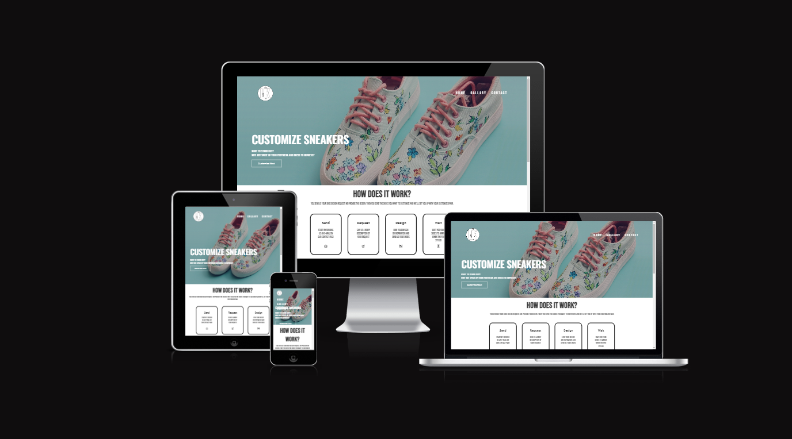

## Features
- Navigation
    - On all three pages there is a responsive navigation bar that includes links to the home page, gallery and contact page.
    - The navigation bar is identical in each page to allow for easy navigation.
    - At any page you can click on the logo that is linked to get to the home page.
    - The navigation is easy to understand and tells the user where each section goes.

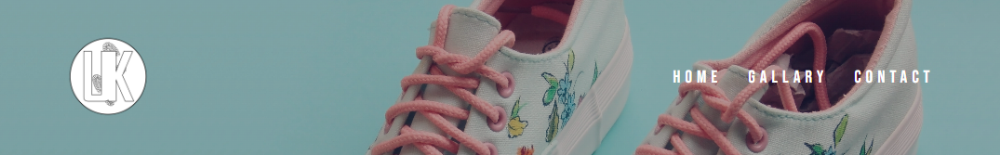


- The Header Image And Text Box
    - The heading has an image as a background with a text floating on its left side to contrast the navigation bar.
    - The image is darkened down to help the text stand out.
    -  Under the text, there is a clickable button linked to the contact page.
    - The section is clear about what the service is and who it is for.

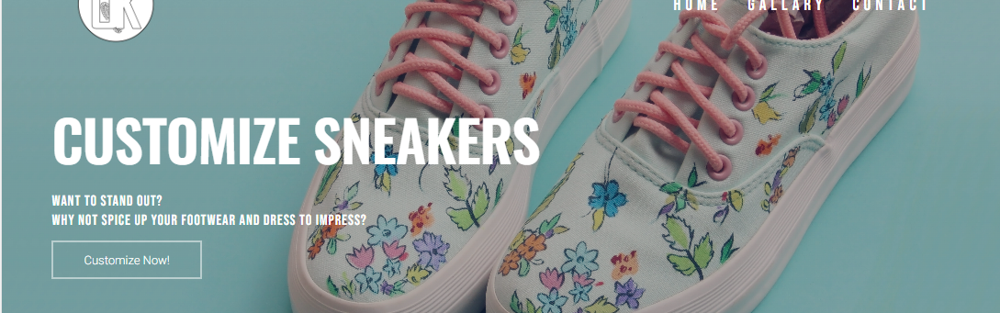

- How Does It Work Section
    - The section helps the user to understand the steps to take for a customized pair of shoes to be ordered.
    - The steps gives a clear guide to the user in order to understand the ease of use for the site.
    - The steps are easily readable with a plesant design.

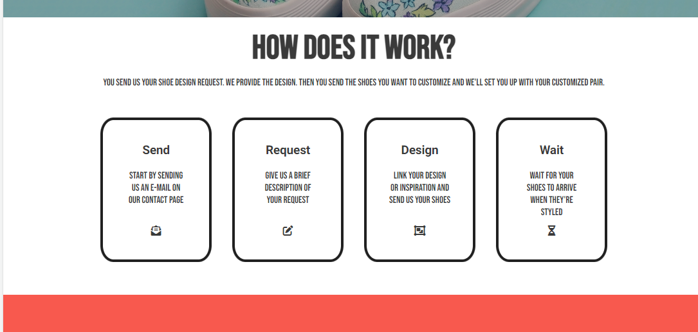

- Check Out Our Gallery Section
    - This section will allow the user to get a get a glimpse into what the product is or could be.
    - The "HERE" button is linked to the full gallery page which is also accessible by the navigation bar.
    - The images featured are relevant and clearly show the user what kind of product they can expect from the service.

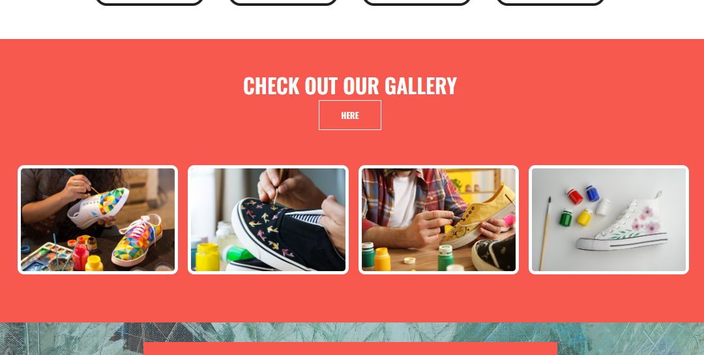

- About Us Section
    - The about us section shows information about the service.
    - The section states in more detail what the site is and who is behind it.
    - The section gives motivation to what the service aims to achieve.
    - The section details that it makes a personalized product to make the potential customer feel special.

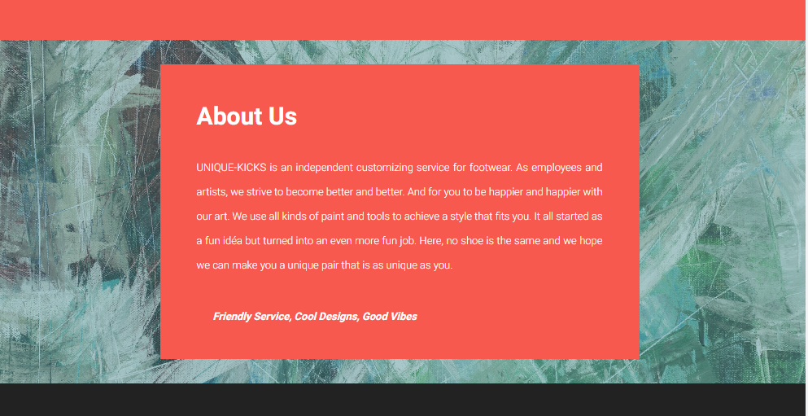

- The Footer
    - The footer includes links to the relevant social media sites for facebook, twitter, youtube and instagram. When clicked, the links will open in a new tab for easy navigation for the user.
    - The footer encourages users of the site to stay connected with the site via social media.

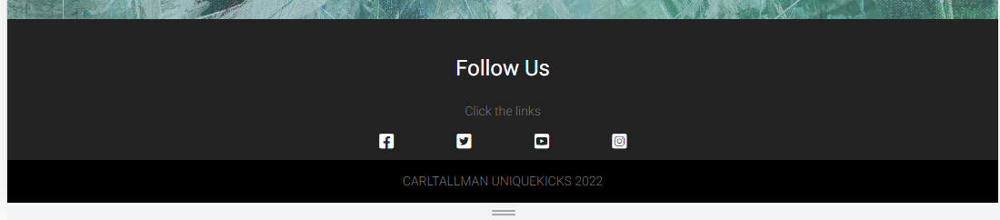

- The Gallery Page
    - The gallery will provide the user with a larger collection of images to see what the customized footwear could potentially look like.
    - The gallery page includes relevant pictures of customized and style footwear that the user can be assured the site can provide.
    - The gallery page features a zoom in effect when you hover over images to give the user a more interactive experience.
    - This gallery page is valuable to the user as they will be able to easily identify the types of styles the site is capable of making.


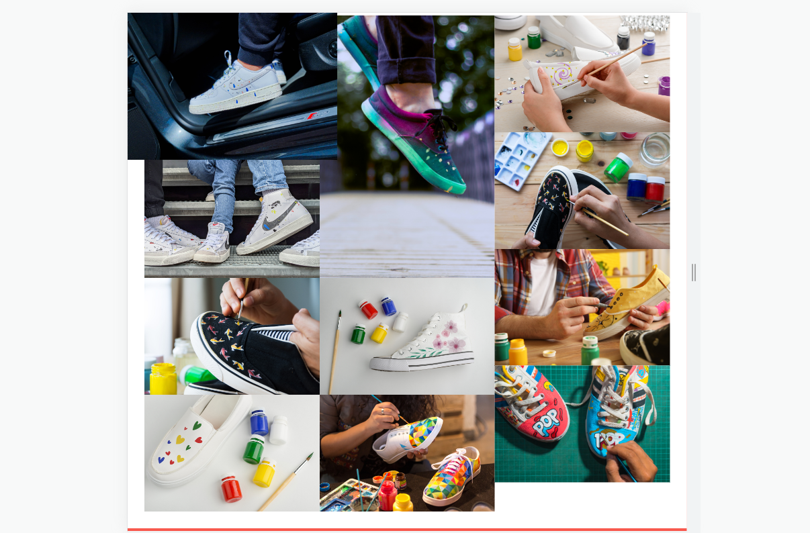


- The Contact Us Page
    - The contact page features a form where the user can enter their information for a style request to be sent.
    - The contact page encourages the users to detail out the style they want for the service to work properly.
    - The contact page is valuable to the user as it gives them flexibility over what they want the service to provide.

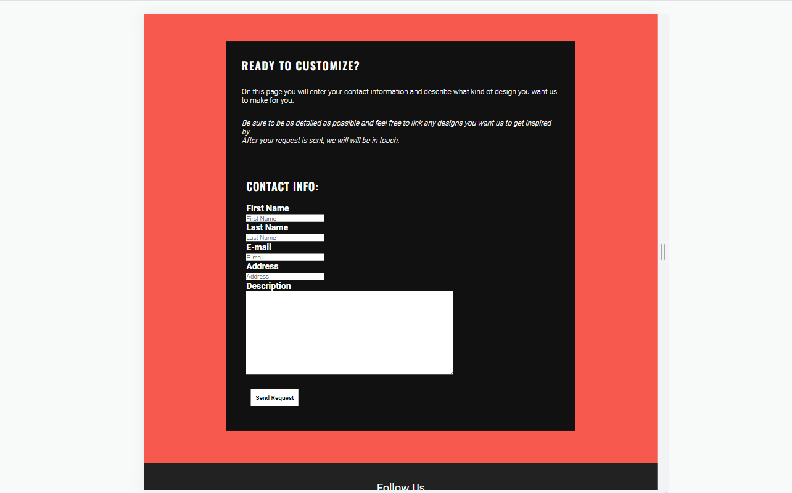

**Features Left to Implement**
- I would have liked to add upload button to the contact page so the user can upload their references more easily. It would also be usefull if the user has a unique design that they've made.

## Testing

- I have tested this project site on different web browsers. Google Chrome, Microsoft Edge and Mozilla Firefox have all been tested and are working.
- Tests while using the site on a Samsung smartphone is also working.
- I have confirmed that the site is looking good and is responsive on different screen sizes by using the devtools device toolbar.
- I have confirmed that the form requires written entries in every field and is working as intended. The email field will only accept an email and the submit button will send the data to the [formdump](https://formdump.codeinstitute.net/) site.

## Bugs
**Solved bugs**
 1. - To make the header background image darker I used a div with a linear-gradient to overlay the image, but the overlay would block the nav-bar from being clickable.
    - I solved the issue by removing the div and then used the linear-gradient inside background-image div property.
 ```
 background-image: linear-gradient(rgba(4,9,30,0.3), rgba(4,9,30,0.3)),
 ```
 2. - The images in the "check out our gallery" wasn't responsive when the screen size shrunk when I used the column-count property.
    - It was solved by using the grid-template-columns property.
 ```
grid-template-columns: repeat(auto-fit, minmax(px, fr));
 ```

**Unfixed bugs**
- On contact page, the description is responsive but not when you start to expand the text field area. I used a media query to change the size of the description but that stopped working when the text area was altered. 
```
@media screen and (max-width: 900px){
.your-description textarea {
    width: 90%;}
}
```

## Validator Testing

- HTML
    - No errors were returned when passing through the official [W3C validator](https://validator.w3.org/nu/?doc=https%3A%2F%2Fcarl-tallman-95.github.io%2FUnique-kicks%2F)
- CSS
    - No errors were found when passing through the official [(Jigsaw) validator](https://jigsaw.w3.org/css-validator/validator?uri=https%3A%2F%2Fcarl-tallman-95.github.io%2FUnique-kicks%2F&profile=css3svg&usermedium=all&warning=1&vextwarning=&lang=sv)

- Accessibility
    - I have confirmed that the colors and fonts chosen for this project are easy to read and are accessible by using the lighthouse in devtools.

    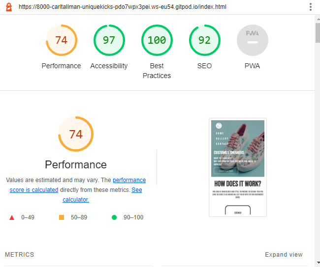

    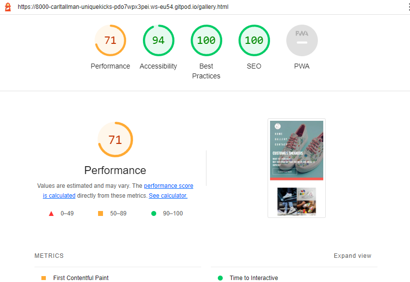

    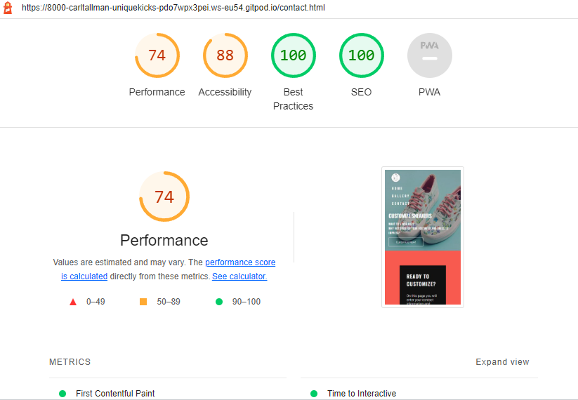

## Deployment


### GitHub pages deployment
- The website was deployed using GitHub pages. To deploy you will need to:
    - Navigate to the GitHub repository, then navigate to the Settings tab.
    - Select the ***Pages***  tab on the left-hand menu.
    - Under the source section drop-down menu, select "Main" branch and save. It should look similar to this:
    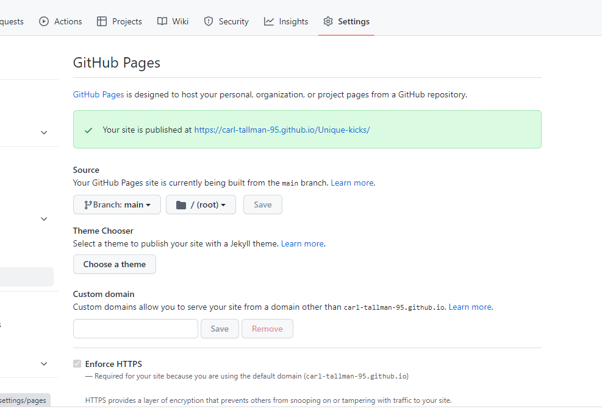

The Live link can be found here - [UNIQUE-KICKS](https://carl-tallman-95.github.io/Unique-kicks/)

 ### Creating a Clone
- To run this project locally you will need to:
    
    - Install the GitPod Browser Extension for the Google Chrome browser.

    - After you have installed the extension, you can restart the browser and log into GitHub.
    - First locate the GitHub Repository, then  click the green GitPod button in the top of the repository. A new GitPod workspace will be created from the code in github where you can work locally.

- To the project within a local IDE you will need to:
    - Log into GitHub and locate the GitHub repository.
    - Click the "Code" button below the repository name.
    - Under where it says "Clone" you should see "HTTPS". Copy the repository clone URL under "HTTPs".
    - Open the terminal in your in your local IDE.
    - Alter the working directory location to where you want the cloned directory to be made.
    - Enter "git clone", then just paste the URL you copied from the clone repository.
    - Press Enter and your local clone should be created.


## Credits
**Content**
- The code to make the header background image was taken from [this youtube tutorial](https://www.youtube.com/watch?v=oYRda7UtuhA&t=2790s).
- The code to make the "Customize Now" button was taken from [W3Schools](https://www.w3schools.com/css/css3_buttons.asp).
- The icons used in the "how does it work?" section and the footer were taken taken from [Font Awesome](https://fontawesome.com/)
- Instructions on how to implement a responsive gallery in the "check out our gallery" section was taken from [this youtube tutorial](https://www.youtube.com/watch?v=wmeJMOxyD-w)
    - Specifically this code property:
    ```
    grid-template-columns: repeat(auto-fit, minmax(px, fr));
    ```

- The code to make the social media links was taken from the CI [Love Running](https://learn.codeinstitute.net/courses/course-v1:CodeInstitute+LR101+2021_T1/courseware/4a07c57382724cfda5834497317f24d5/e6d4cda2bc08458ba94d2092be9bad3a/) Project.

- The code to make the gallery page was taken from the CI [Love Running](https://learn.codeinstitute.net/courses/course-v1:CodeInstitute+LR101+2021_T1/courseware/4a07c57382724cfda5834497317f24d5/06b2421978a4470d844b06c7bf2c50a2/) Project.
    - The code to make the images zoom when hover over was taken from [codepen.io](https://codepen.io/skcals/pen/WKpqmG).

- Instructions on how to implement the form correctly on the Sign Up page was taken from the CI [Form Inputs](https://learn.codeinstitute.net/courses/course-v1:CodeInstitute+HE101+2020/courseware/fcc67a894619420399970ae84fc4802f/643317b091da4eef98fe9e0812a71715/).

>A special thanks to all of the resources that helped this project on the way to be what it is today!

- Thanks to [Emmacharleswilson](https://github.com/Emmacharleswilson) on how to create a clone in her [README.md](https://github.com/Emmacharleswilson/Discover3c#readme)!

**Media**
- The header background image was taken from [Shutterstock](https://www.shutterstock.com/).
- The images used in the "check out our gallery" section was taken from [Shutterstock](https://www.shutterstock.com/).
- The about us background image was taken from [Unsplash](https://unsplash.com/)
- The images used in the gallery page was taken from both [Unsplash](https://unsplash.com/) and [Shutterstock](https://www.shutterstock.com/).